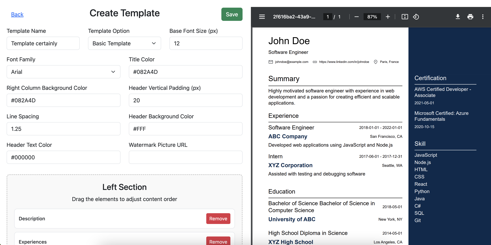
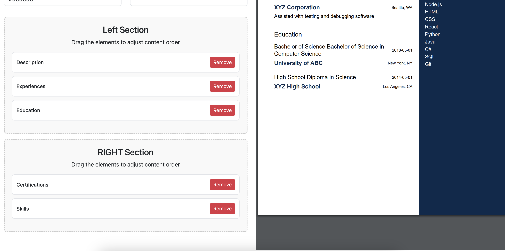
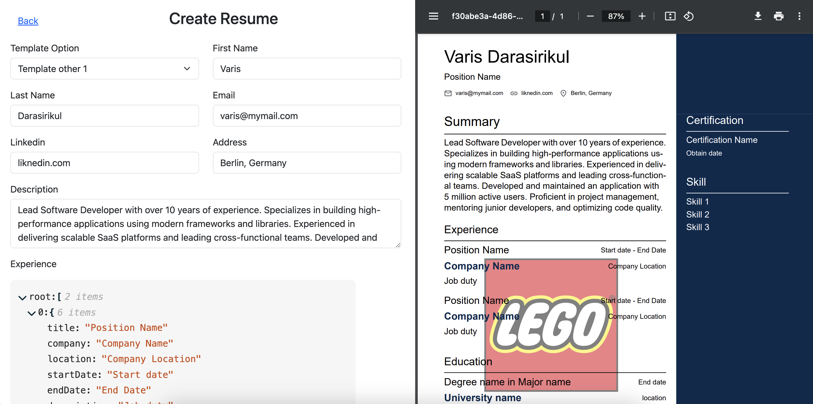
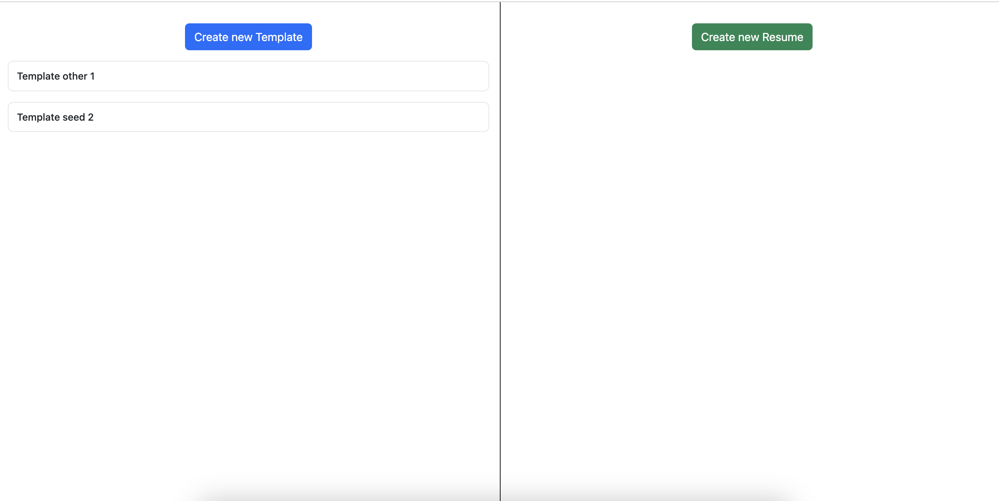

# Resume Builder

This project is a Resume Builder application built using **Vite**, **React**, and **TypeScript**. The application allows users to create and customize resume templates, and it can be easily containerized and run using Docker.

## Overview

The development of the resume builder application was the result of a comprehensive research and investigative process, during which various resume builder tools were analyzed and compared. After evaluating the features, user experiences, and technical implementations of several platforms, it became clear that [Resume.io](https://resume.io/app/resumes/38374713/edit) provided the most intuitive and feature-rich experience, making it the primary inspiration for our application.

This documentation outlines the research, tools, libraries, and processes used in the development of the resume builder application.

## Research and Investigation of Resume Builder Tools

### Investigating Other Resume Builders

Before settling on Resume.io as the primary inspiration, several other resume builder tools were explored. These included:
- **Canva:** Known for its design flexibility, Canva offers a vast array of templates and customization options. However, it lacks the real-time PDF preview and drag-and-drop reordering features that are critical for a seamless resume-building experience.
- **Zety:** This tool provides excellent template options and a straightforward step-by-step wizard. However, its interface is somewhat rigid, lacking the dynamic real-time feedback and reordering features that are crucial for providing a smooth user experience.
- **Novoresume:** This platform offers an attractive design interface with some level of customization. However, the lack of flexibility in adjusting sections and limited live preview capabilities made it less appealing for our goals.

### Selecting Resume.io as the Model

After analyzing these and other tools, it was clear that Resume.io offered the best balance of usability, flexibility, and functionality. Its features, such as:
- **Real-time PDF Preview:** The ability to see changes instantly reflected in a preview pane ensures users can immediately see the impact of their edits.
- **Drag-and-Drop Reordering:** This allows users to effortlessly customize the order of their resume sections, enhancing flexibility.
- **Intuitive User Interface:** The clean and intuitive design made it easy for users to navigate and customize their resumes without a steep learning curve.

These features became the cornerstone of our application, driving the decision to replicate and expand upon them using modern web development technologies.

## Inspiration and Core Features

### Side-by-Side Preview with Real-Time Render

The ability to see a real-time preview of the resume while making edits is a powerful feature that significantly enhances the user experience. This feature was directly inspired by Resume.io, where users can see their changes reflected instantly on the document preview.

In our application, we achieved this by integrating the [React PDF](https://react-pdf.org/) library. This library allows us to create a PDF document dynamically and render it in a React component. We used the `<PDFViewer />` component from `@react-pdf/renderer` to show the live preview of the resume, ensuring that any changes made in the form are immediately visible in the preview pane.

**Screenshots of the Implementation:**
1. 
2. 
3. 

### Drag and Drop Reordering

Another significant feature of Resume.io that we incorporated is the drag-and-drop functionality for reordering sections of the resume. This feature enhances the flexibility of the resume builder, allowing users to customize the order of sections according to their preference.

We implemented this feature using the [React DnD](https://react-dnd.github.io/react-dnd/about) library, which provides a powerful set of tools to handle drag-and-drop interactions in a React environment. Specifically, we used `useDrag` and `useDrop` hooks to manage the drag-and-drop behavior of the different sections of the resume.

**Screenshot of Drag and Drop in Action:**


## Research and Implementation Process

### 1. Selecting the Appropriate Libraries

The choice of libraries was critical to achieving the desired functionality with minimal overhead. Based on the requirements:
- **React PDF** was chosen for PDF generation and rendering because it integrates seamlessly with React and allows for real-time updates.
- **React DnD** was selected for its flexibility and robustness in handling drag-and-drop operations.

### 2. Integrating Real-Time PDF Rendering

The React PDF library was integrated into the application by creating a set of components that map to different sections of the resume (e.g., `BasicTemplate`, `BasicExperience`, `BasicEducation`). These components are rendered within a `<PDFViewer />`, allowing the resume to be displayed in a PDF format as the user edits the form fields.

### 3. Implementing Drag-and-Drop Reordering

Using React DnD, we created draggable cards (`DraggableCard` components) for each section of the resume. These cards can be dragged to reorder the sections within predefined areas of the resume. The drag-and-drop state is managed using the `useDrag` and `useDrop` hooks provided by React DnD.

### 4. Handling State and Form Management

We used React's `useState` and `useMemo` hooks to manage the state of the form and resume data. The application watches the form data using the `react-hook-form` library, ensuring that any changes are instantly reflected in the PDF preview.

### 5. Testing and Validation

We conducted thorough testing to ensure that the drag-and-drop functionality worked as expected and that the real-time PDF rendering was smooth and accurate. Additionally, form validation was implemented using the `Yup` schema validation library, integrated with `react-hook-form`, to ensure that all necessary fields are correctly filled out before the resume can be saved or exported.

## Future Improvements

While the current version of the resume builder application provides core functionality inspired by industry-leading tools, there are several features that could be added to enhance its capabilities:

1. **Update Created Template**: Currently, users can create new templates but lack the ability to update or modify existing ones. Implementing a feature that allows users to edit and update their saved templates would greatly improve the application's flexibility and user experience.

2. **Save and Edit Created Resume**: The application currently allows for the creation of resumes, but once a resume is created, there is no functionality to save it for future editing. Adding the ability to save and later edit created resumes would make the tool much more practical for users who need to update their resumes regularly.

3. **Multiple Templates:** Due to time constraints, the application currently includes only one template option. As this is a proof-of-concept (POC) project, the next steps should involve expanding the template library to offer users a variety of resume formats and designs to choose from.

These features represent potential areas for further development if the project continues, ensuring the application remains competitive and aligned with user expectations.


## Features

- **Vite**: Lightning-fast build tool for modern web projects.
- **React**: A JavaScript library for building user interfaces.
- **TypeScript**: Strongly typed programming language that builds on JavaScript.
- **Docker**: Containerization to ensure consistent environments for development, testing, and production.
- **Unit Testing**: Using **Vitest** for fast unit testing.

## Prerequisites

Before you begin, ensure you have met the following requirements:

- **Node.js** (version 16 or higher)
- **Docker** (if you want to build and run the application in a container)

## Installation

1. **Clone the repository**:
   ```bash
   git clone https://github.com/manjarb/POC-REACT-RESUME-BUILDER.git
   cd resume-builder
   ```

2. **Install dependencies**:
    ```bash
    npm install
    ```
## Scripts

The following scripts are available in this project:

- **Development Server**:
  ```
  npm run dev
  ```
  This will start the development server using Vite. Open your browser and navigate to `http://localhost:3000` to view the application.

- **Build**:
  ```
  npm run build
  ```
  This will build the application for production. The output will be in the `dist` directory.

- **Test**:
  ```
  npm run test
  ```
  This will run the unit tests using Vitest.

- **Docker Build**:
  ```
  npm run docker:build
  ```
  This will build the Docker image for the application.

- **Docker Run**:
  ```
  npm run docker:run
  ```
  This will run the Docker container and map port 80 inside the container to port 3000 on your local machine. Access the application at `http://localhost:3000`.

## Running the Application with Docker

To build and run the application using Docker, follow these steps:

1. **Build the Docker Image**:
    ```
    npm run docker:build
    ```
2. **Run the Docker Container**:
    ```
   npm run docker:run
    ```
   The application will be available at `http://localhost:3000`.

## How the Application Works

The resume builder application is designed to provide users with an intuitive, real-time interface for creating and customizing professional resumes. Below is a step-by-step explanation of how the application functions, using screenshots to illustrate each stage of the process.

### 1. Home Page

When the user first opens the application, they are greeted with the Home Page, where they can either create a new template or resume. The left side of the page lists any previously created templates, while the right side provides an option to create a new resume.



### 2. Creating a Template

Upon clicking "Create new Template," the user is taken to the template creation interface. This page allows the user to define the layout, font size, colors, and other stylistic choices for their resume. The left section contains a form where the user can input these customization options.

On the right side of the screen, the user can see a real-time preview of the resume, which updates automatically as changes are made in the form.


Users can also drag and drop elements to reorder sections in the resume. For instance, they can rearrange the order of the "Description," "Experiences," and "Education" sections by dragging and dropping them in the desired order.


### 3. Creating a Resume

After setting up a template, users can proceed to create a resume by selecting a template from the dropdown menu on the "Create Resume" page. Here, they can input their personal details, experiences, education, certifications, and skills.

Similar to the template creation page, this section also includes a real-time preview on the right side, which reflects the changes as the user inputs their information.


### 4. PDF Preview

Once the resume is fully built, users can view the final product in the PDF viewer on the right side of the screen. This allows them to see exactly how their resume will look when downloaded or printed. The PDF preview is fully functional and can be zoomed in/out, navigated page by page, and even downloaded directly from the interface.


### Summary

In summary, this application offers a streamlined process for building and customizing resumes with a focus on real-time feedback and ease of use. Users can design their resume templates, input their information, and view a live preview, all within the same interface.


## Conclusion

The development of this resume builder application was a collaborative and iterative process that involved extensive research and experimentation with various libraries and tools. The decision to draw inspiration from Resume.io was made after carefully evaluating multiple resume builder platforms and determining that Resume.io provided the best user experience.

The end result is a highly functional and user-friendly application that allows users to create, customize, and preview their resumes in real-time, with a flexible drag-and-drop interface for reordering sections. This combination of features ensures that the application not only meets but exceeds the expectations of users, offering a powerful and intuitive resume-building experience.

## Contact

If you have any questions or feedback, feel free to reach out.
